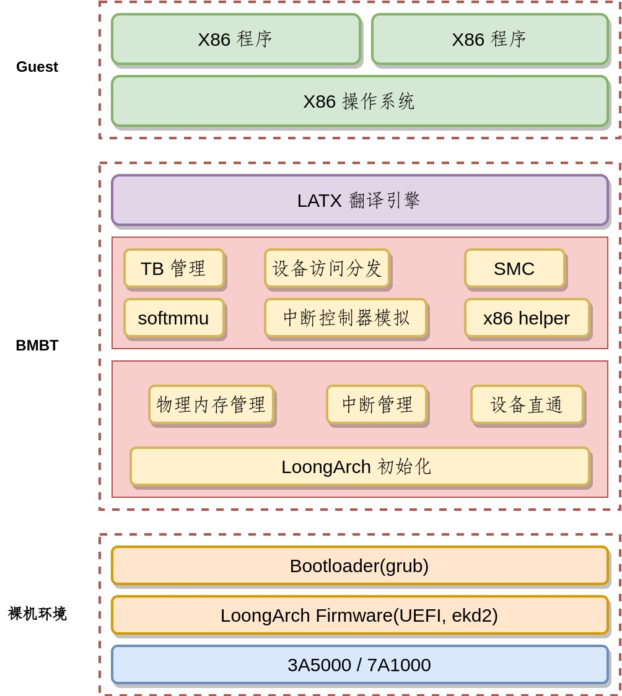

# 裸金属二进制翻译器

- [论文](./paper/thesis.pdf)
- [slies](./slides/bmbt.pdf)

## FAQ
- 可以做什么?
  - 将龙芯电脑"变成" x86 电脑。
- 为什么要将二进制翻译器运行在裸机上?
    - 类似 unikernel 的思想，只有一个地址空间，可以消除上下文切换和 TLB miss
    - 可以实现设备直通
    - 可以直接访问硬件 TLB 来加速地址翻译
- 软件架构是什么样子? 

  

## 手动编译
- 论文: https://github.com/mohuangrui/ucasthesis
- ppt: https://github.com/matze/mtheme
